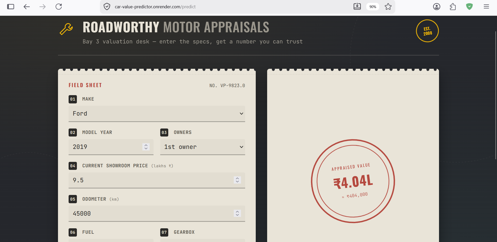
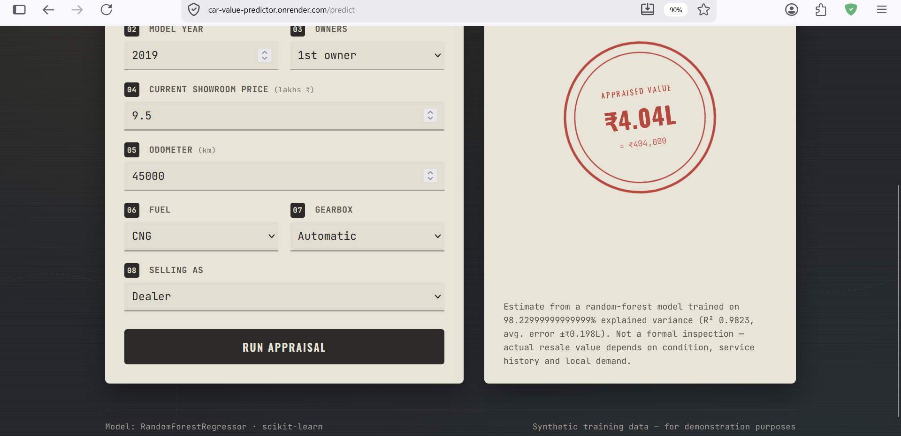

# Roadworthy — Car Value Predictor

A used-car resale value predictor: a scikit-learn model behind a Flask web
app, styled like a mechanic's vehicle appraisal ticket. Enter a car's make,
year, price, mileage, fuel type, transmission and ownership history, and it
stamps out an estimated resale value.

## Images



## How it works

- **`generate_data.py`** — builds a synthetic but realistic 3,000-row used-car
  dataset (`car_data.csv`) with a depreciation model baked in (age, mileage,
  fuel type, transmission, ownership all affect price, plus market noise).
  Swap this out for a real dataset (e.g. Kaggle's "Vehicle Dataset from
  CarDekho") if you want real-world accuracy — just keep the same column
  names, or adjust `train_model.py` to match.
- **`train_model.py`** — trains a `RandomForestRegressor` inside a
  scikit-learn `Pipeline` (one-hot encoding + model), evaluates it
  (currently **R² ≈ 0.98, MAE ≈ ₹0.19L** on held-out data), and saves the
  whole pipeline to `model/car_price_model.pkl` plus UI metadata to
  `model/metadata.json`.
- **`app.py`** — Flask app. `/` renders the form, `POST /predict` returns the
  rendered result page, `POST /api/predict` returns a JSON prediction, and
  `/health` is a health check for Render.
- **`templates/` / `static/`** — the appraisal-ticket UI.

## Run locally

```bash
pip install -r requirements.txt

# (optional) regenerate data & retrain — a trained model is already included
python generate_data.py
python train_model.py

python app.py
# open http://localhost:5000
```

## JSON API

```bash
curl -X POST http://localhost:5000/api/predict \
  -H "Content-Type: application/json" \
  -d '{"brand":"Toyota","year":2020,"present_price":14.5,"kms_driven":35000,
       "fuel_type":"Diesel","seller_type":"Dealer","transmission":"Automatic","owner":0}'
```

## Deploy on Render

**Option A — Blueprint (one click, uses `render.yaml`)**
1. Push this folder to a new GitHub repository.
2. In the [Render Dashboard](https://dashboard.render.com), click **New →
   Blueprint**, connect the repo, and Render will read `render.yaml` and set
   everything up automatically (build command, start command, health check).
3. Click **Apply**. First deploy takes a few minutes; you'll get a URL like
   `https://car-value-predictor.onrender.com`.

**Option B — Manual web service**
1. Push this folder to GitHub.
2. In Render, click **New → Web Service** and connect the repo.
3. Set:
   - **Runtime:** Python 3
   - **Build Command:** `pip install -r requirements.txt`
   - **Start Command:** `gunicorn app:app --bind 0.0.0.0:$PORT`
4. Click **Create Web Service**.

Render sets the `PORT` environment variable automatically — `app.py` and the
`Procfile`/`render.yaml` both already read it, so no extra config is needed.

### Notes
- The free Render plan spins down after inactivity, so the first request
  after idle time will be slow (~30–60s cold start).
- `model/car_price_model.pkl` is committed to the repo so Render doesn't need
  to retrain on every deploy. If you retrain locally, just commit the new
  `.pkl` file.
- To use a real dataset instead of the synthetic one, replace `car_data.csv`
  and re-run `python train_model.py` before deploying.
